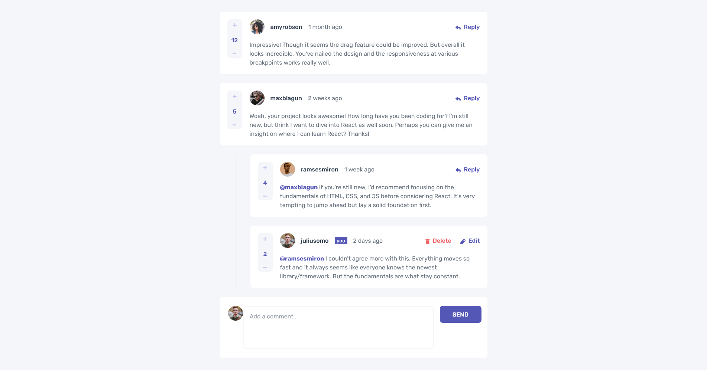
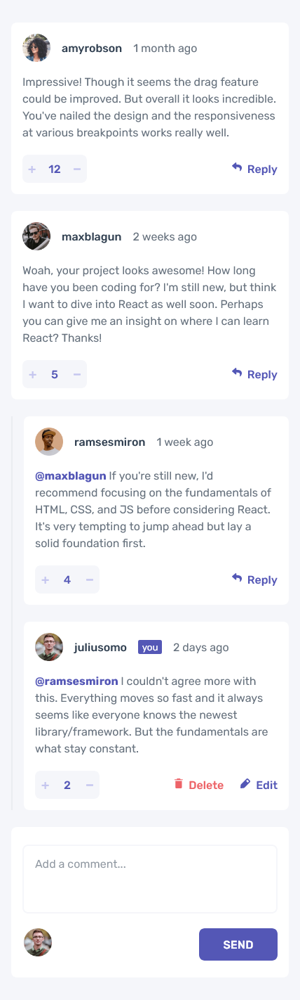

# Frontend Mentor - Interactive comments section solution

This is a solution to the [Interactive comments section challenge on Frontend Mentor](https://www.frontendmentor.io/challenges/interactive-comments-section-iG1RugEG9).
## Table of contents

- [Overview](#overview)
  - [The challenge](#the-challenge)
  - [Screenshot](#screenshot)
  - [Links](#links)
- [My process](#my-process)
  - [Built with](#built-with)
  - [What I learned](#what-i-learned)
  - [Continued development](#continued-development)
  - [Useful resources](#useful-resources)
- [Author](#author)

## Overview

### The challenge
- This was a fun and challenge and a great way to test my skills, particularly with CSS. The challenge provides images of the designs that I am to replicate and using

Users should be able to:

- View the optimal layout for the app depending on their device's screen size
- See hover states for all interactive elements on the page
- Create, Read, Update, and Delete comments and replies
- Upvote and downvote comments
- **Bonus**: If you're building a purely front-end project, use `localStorage` to save the current state in the browser that persists when the browser is refreshed. (TODO)
- **Bonus**: Instead of using the `createdAt` strings from the `data.json` file, try using timestamps and dynamically track the time since the comment or reply was posted.

### Screenshot

<!--  -->

### Links

<!-- - Solution URL: [Add solution URL here](https://your-solution-url.com) -->
- Live Site URL: [Live Site](https://optimistic-goodall-4ce36f.netlify.app/)

## My process

- I first sketched out the app with React components
- Then I used flexbox to position components where they'd roughly need to be
- Next I added and applied the styles, using the project's style guide
- Following that, my focus was adding the functionality of the site (nested comments, adding new comments, updating and deleting, replying)
- Finally I spent time adjusting the padding, margin and layouts in general, often consulting the provided image files

### Built with

- Semantic HTML5 markup
- CSS custom properties
- Flexbox
- [React](https://reactjs.org/) - JS library

### What I learned

- While working on this project I've been able to solidify my knowledge of flexbox and gain a better grasp of how it works and how to use it to achieve a responsive layout. 
- I learned how to use the JS Date object to calculate elapsed time
- I learned how to use recursion in order to render nested React components (the nested comment structure)

### Continued development

- One thing to add would be the use of localStorage in order to save the current state and have it persist even when the page is refreshed.
- Another thing I would do is add further breakpoints for the responsive layouts, as the project only specifies 375px for mobile and 1440px for desktop as a requirement. 

## Author

- Website - Coming Soon!
- Frontend Mentor - [@TheDilp](https://www.frontendmentor.io/profile/TheDilp)
